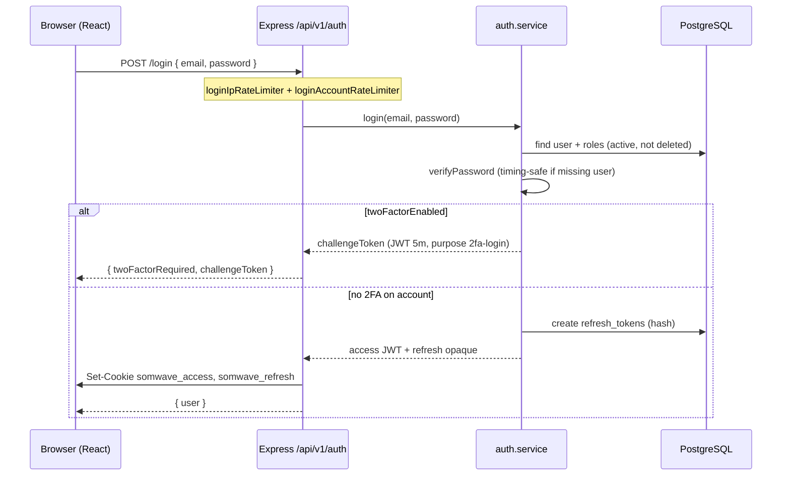
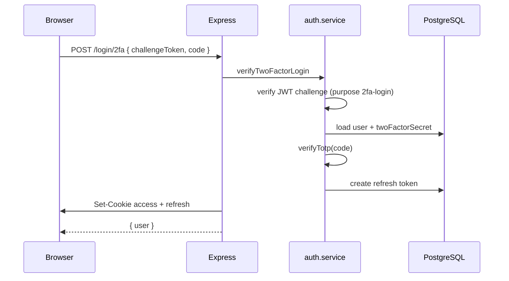
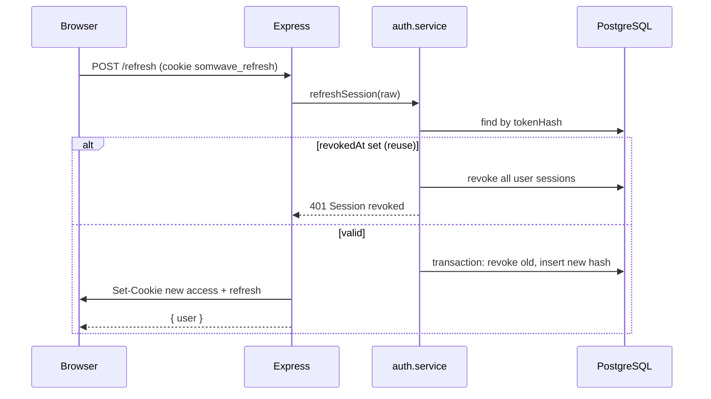
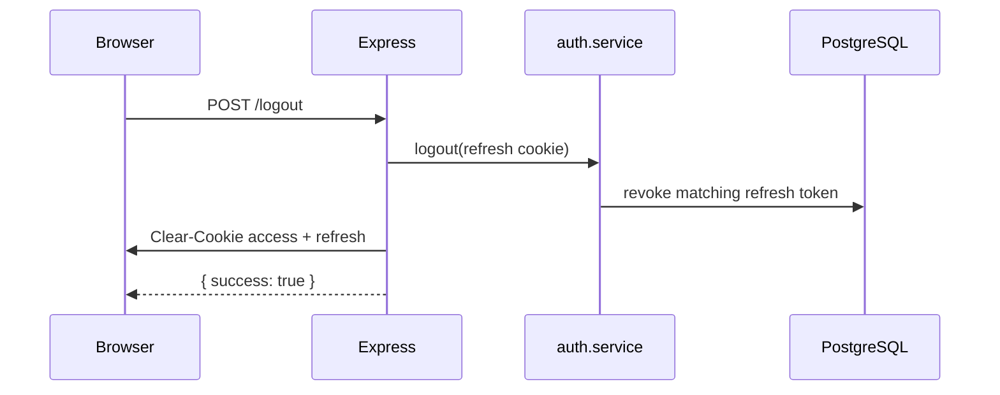

# Warbixin Auth — Somwave

**Taariikh:** 22 Sebtember 2026  
**Laamaha tixraaca:** `cursor/p1-evc-plus-ae9d` (isku-darka P0 + auth/2FA)  
**Ujeeddo:** Soo koobid xirfadeed oo ku saabsan sida aqoonsiga (authentication), ogolaanshaha (authorization), iyo amniga fadhiga loo hirgeliyay, iyo farqiga u dhexeeya waxa la dhammeeyay iyo shuruudaha `CLAUDE.md` §13.

---

## 1. Soo koobid fulinta (Executive summary)

Somwave wuxuu isticmaalaa **JWT gaaban (15 daqiiqo)** iyo **refresh token aan la aqoonsan karin (30 maalmood)** oo lagu keydiyo **httpOnly cookies**, iyadoo refresh-ku **la wareejiyo (rotate)** marka la isticmaalo, isla markaana **dib-u-isticmaalka (reuse)** uu joojiyo dhammaan fadhiyada isticmaaleha. Gelitaanka waxaa ilaaliya **bcrypt (cost 12)**, **xaddidaad IP + akoon** ee `/auth/login`, iyo **CORS allow-list** oo leh `credentials: true`.

**2FA (TOTP)** waa la dhisay: diiwaangelin (`/auth/2fa/setup`, `/auth/confirm`), caqabad gelitaan (`challengeToken` + `/auth/login/2fa`), iyo UI Soomaali (`LoginPage`, `TwoFactorSetupPage`). Doorka **SUPER_ADMIN**, **ADMIN**, iyo **MANAGER** waxaa loo calaamadiyay in 2FA ay **qasab** tahay; frontend-ku wuxuu ku qasbaa `/settings/2fa` iyadoo `ProtectedRoute` ay joojiso inta aan la shidin.

**Waxyaabaha weli daciif ah:** frontend-ku **ma waco** `/auth/refresh` marka access-ku dhaco; doorka mudnaanta leh **weli wuu geli karaa** haddii 2FA aan la shidin (kaliya UI ayaa xannibaysa, ma aha backend); sirta TOTP **ma laha encryption at rest** sida §13 u sheegayo xog xasaasi ah; ma jiraan tijaabooyin buuxa ee **refresh rotation / reuse**.

**Production (#41):** cookies-ka production waxay isticmaalaan `SameSite=None; Secure`, iyo nginx dashboard-ka wuxuu `/api/` u gudbiyaa API-ga si cookies-ku u noqdaan **first-party** on `app.*`.

---

## 2. Qaab-dhismeedka (Architecture)

### 2.1 Lakabka backend

| Lakab | Fayl(lada) | Shaqada |
|--------|------------|---------|
| Routes | `backend/src/routes/auth.routes.ts` | Xaddidaadda, validate, xulashada controller |
| Controller | `backend/src/controllers/auth.controller.ts` | Cookies, jawaab envelope |
| Service | `backend/src/services/auth.service.ts` | Prisma, furaha, 2FA, refresh — **kaliya halkan Prisma** |
| Middleware auth | `backend/src/middleware/auth.ts` | `requireAuth` — JWT cookie + context live |
| Middleware rbac | `backend/src/middleware/rbac.ts` | `rbac('permission.key')` — kadib auth |
| Tokens | `backend/src/lib/tokens.ts` | JWT access, 2FA challenge, refresh hash |
| Cookies | `backend/src/lib/cookies.ts` | `somwave_access`, `somwave_refresh` |
| Password | `backend/src/lib/password.ts` | bcrypt cost 12 |
| TOTP | `backend/src/lib/totp.ts` | otplib, issuer Somwave |
| Env | `backend/src/lib/env.ts` | `JWT_SECRET` ≥ 32, CORS, DATABASE_URL, iwm. |

Pipeline guud (`app.ts`): `helmet` → `cors(credentials)` → `cookieParser` → `pinoHttp` → `apiRateLimiter` → `/api/v1/auth/*`.

### 2.2 Lakabka frontend

| Qayb | Fayl(lada) | Shaqada |
|------|------------|---------|
| API | `frontend/src/features/auth/api.ts` | `apiFetch` + `/auth/*` |
| Hooks | `frontend/src/features/auth/hooks.ts` | TanStack Query: `me`, login, 2FA, logout |
| Login | `frontend/src/features/auth/LoginPage.tsx` | Email/furaha + caqabad 2FA |
| Ilaalinta | `frontend/src/features/auth/ProtectedRoute.tsx` | `/login`, qasab 2FA |
| 2FA setup | `frontend/src/features/auth/TwoFactorSetupPage.tsx` | TOTP enrollment |
| Client HTTP | `frontend/src/lib/apiClient.ts` | `fetch` keliya halkan, `credentials: 'include'` |
| RBAC UI | `frontend/src/lib/rbac.ts` | `hasPermission` — **UX kaliya** |

### 2.3 Shared contract

`packages/shared/src/schemas/auth.ts`: `loginSchema`, `verifyTwoFactorSchema`, `confirmTwoFactorSchema`, `AuthUser`, `isTwoFactorRequired()`.  
`packages/shared/src/constants/roles.ts`: `TWO_FACTOR_REQUIRED_ROLES` = SUPER_ADMIN, ADMIN, MANAGER.

---

## 3. Sawirro socodka (Mermaid)

### 3.1 Gelitaanka caadiga ah (aan 2FA lahayn ama 2FA hore loo shiday)

### 3.2 Caqabad 2FA gelitaanka

### 3.3 Refresh (backend — frontend weli ma isticmaalo si otomaatig ah)

### 3.4 Ka bixitaanka (logout)

---

## 4. Jadwalka endpoints

Dhammaan waddooyinka hoos yimaada waxay ku jiraan **`/api/v1/auth`**. Jawaabtu waa envelope `{ data, meta? }` ama `{ error }` (§10).

| HTTP | Waddo | Auth | Validate (shared) | Sharaxaad |
|------|-------|------|-------------------|-----------|
| POST | `/login` | Maya | `loginSchema` | Furaha; 2FA → `challengeToken`, haddii kale cookies + `user` |
| POST | `/login/2fa` | Maya | `verifyTwoFactorSchema` | Dhammaystir gelitaanka 2FA |
| POST | `/refresh` | Cookie refresh | — | Wareejin refresh + JWT cusub |
| POST | `/logout` | Cookie refresh (optional) | — | Revoke + clear cookies |
| GET | `/me` | `requireAuth` | — | `AuthUser` live (roles/permissions) |
| POST | `/2fa/setup` | `requireAuth` | — | Sirta TOTP + `otpauthUrl` (kayd DB, enabled=false) |
| POST | `/2fa/confirm` | `requireAuth` | `confirmTwoFactorSchema` | Xaqiiji koodhka, `twoFactorEnabled=true` |

**Xaddidaad gelitaanka:** IP — 20 codsiyood / 15 daqiiqo; akoon (email) — 5 / 15 daqiiqo (`rateLimit.ts`).

---

## 5. Cookies iyo tokens

| Nooc | Magaca cookie | Nuxurka | Cimri | Guryaha |
|------|---------------|---------|-------|---------|
| Access | `somwave_access` | JWT (`sub` = userId) | 15 daqiiqo | httpOnly, path `/` |
| Refresh | `somwave_refresh` | Opaque base64url (48 bytes) | 30 maalmood | httpOnly; DB: SHA-256 hash kaliya |
| 2FA challenge | — (JSON body) | JWT + `purpose: 2fa-login` | 5 daqiiqo | Ma aha cookie |

**SameSite / Secure (`cookies.ts`):**

- **Development:** `sameSite: 'lax'`, `secure: false` (localhost + Vite).
- **Production:** `sameSite: 'none'`, `secure: true` — lagama maarmaan CORS cross-origin `app.*` → `api.*` (#41).

**JWT_SECRET:** waa inuu ahaadaa ugu yaraan 32 xaraf; process-ku wuu istaagaa haddii validation-ku fashilmo (`env.ts`). Qiimaha lama daabaco log-ga.

---

## 6. Doorka (Roles) iyo 2FA qasab ah

Doorka nidaamka (`ROLES`): SUPER_ADMIN, ADMIN, MANAGER, STAFF, EDITOR, CLIENT, GUEST.

**2FA qasab (§13 / `TWO_FACTOR_REQUIRED_ROLES`):** SUPER_ADMIN, ADMIN, MANAGER.

| Mechanism | Halka | Waxa sameeya |
|-----------|-------|--------------|
| Calaamad `twoFactorRequired` | `AuthUser` (backend + frontend) | `isTwoFactorRequired(roles)` |
| Qasab enrollment | `ProtectedRoute.tsx` | Haddii `twoFactorRequired && !twoFactorEnabled` → `/settings/2fa` |
| Qasab gelitaan 2FA | `auth.service.login` | Kaliya haddii `twoFactorEnabled === true` |
| **Ma jiro** | Backend login | Ma diido session doorka mudnaanta leh ee aan weli shidin 2FA |

**Sidaas:** isticmaale ADMIN ah oo aan 2FA shidin wuxuu heli karaa cookies haddii uu geliyo furaha saxda ah; API-yada kale ee `requireAuth` ayaa shaqayn kara ilaa frontend-ku xannibo. Tani waa **farqi amni** marka la eego §13 (“2FA mandatory”).

---

## 7. Authentication vs Authorization

| Fikrad | Middleware / code | Su'aasha laga jawaabayo |
|--------|-------------------|-------------------------|
| **Authentication** | `requireAuth` | Yaa ku jira codsigan? JWT sax + user active + context DB |
| **Authorization** | `rbac('key')` | Ma leeyahay ogolaanshahan? `user.permissions.includes(key)` |

Tilmaamo:

- `requireAuth` wuxuu **dib u soo rarayaa** roles/permissions DB (token-ka JWT ma xambaarsado permissions).
- `rbac` wuxuu soo celiyaa **403 FORBIDDEN** haddii permission maqan tahay; **401** haddii `authUser` ma jiro.
- Frontend `Can` / `hasPermission` waa **UX kaliya** — backend waa ilaalinta dhabta ah (§13).

---

## 8. Socodka frontend

1. **Bogga `/login`:** React Hook Form + `loginSchema`; haddii `twoFactorRequired`, UI labaad ee koodhka 6-lambar.
2. **Guul:** TanStack Query `['auth','me']` waxaa lagu cusboonaysiiyaa `user`; navigate `/`.
3. **Bogag la ilaaliyo:** `ProtectedRoute` → `GET /auth/me` (cookie); loading / error → `/login`.
4. **2FA enrollment:** `/settings/2fa` — bilow setup, muuji `otpauthUrl` + secret, xaqiiji koodhka.
5. **Logout:** `POST /auth/logout`, cache `me` → `null`.

**Farqi:** Ma jiro interceptor ama hook u waca **`POST /auth/refresh`** marka access-ku dhaco (15 daqiiqo). Kadib dhicitaanka JWT, `/auth/me` iyo API-yada kale waxay noqon karaan **401** ilaa isticmaalehu mar kale galo ama refresh la daro.

---

## 9. Hagaajinta production — portal cookies (#41)

**Dhibaatada:** Dashboard (`app.somwave.botandev.com`) wuxuu API u yeedhaa `api.somwave.botandev.com` — **cross-site**. `SameSite=Lax` cookies **lama kaydin** jawaabta login POST; `/auth/me` cookie ma hayo → SPA dib ugu booda `/login`.

**Xalka la hirgeliyay:**

1. **`backend/src/lib/cookies.ts`:** production → `sameSite: 'none'`, `secure: true` (test: `cookies.test.ts`).
2. **`frontend/nginx.conf`:** `location /api/` → `proxy_pass` API-ga; SPA wuxuu u yeedhaa **`/api/v1/*` isla host-ka** si cookies-ku u noqdaan first-party (test: `nginx.conf.test.ts`).
3. **CORS:** `credentials: true`, origin allow-list (`cors.ts`, `CORS_ORIGINS` env).
4. **Frontend Dockerfile / `VITE_API_URL`:** waa in aan la dhigin URL cross-origin haddii nginx proxy la isticmaalayo (eeg faallo Dockerfile).

**Hubinta staging:** Network tab — login POST waa inuu leeyahay `Set-Cookie` leh `Secure` + `SameSite=None` (haddii cross-origin toos ah loo isticmaalo), ama cookies first-party haddii `/api/` proxy la isticmaalo.

---

## 10. Amniga §13 — waxa la sameeyay vs maqan

| Shuruud (§13) | Xaaladda | Faallo |
|---------------|----------|--------|
| JWT access 15m + refresh 30d httpOnly | ✅ | `tokens.ts`, `cookies.ts` |
| Refresh rotate + reuse → revoke all sessions | ✅ | `refreshSession` + log warn |
| bcrypt cost 12 | ✅ | `password.ts` |
| Rate limit login IP **iyo** akoon | ✅ | `auth.routes.ts` |
| `trust proxy` 1 | ✅ | `app.ts` |
| CORS ma aha `*` | ✅ | `buildCorsOptions` |
| 2FA qasab SUPER_ADMIN, ADMIN, MANAGER | ⚠️ Qayb | UI qasab enrollment; backend ma xannibo login |
| 2FA TOTP enrollment + login challenge | ✅ | service + UI |
| Env validated boot (JWT_SECRET) | ✅ | `env.ts` |
| Per-query scoping (404 not 403) | ✅ (guud ahaan nidaamka) | Auth-ga ma aha mowduuca ugu weyn |
| 2FA secret encrypted at rest | ❌ | `twoFactorSecret` plain text DB |
| Sensitive columns encryption (salary, bank) | ❌ / meel kale | HR/finance — ka baxsan warbixintan |
| Upload MIME / S3 | ❌ | Ma aha auth |
| 2FA challenge rate limit gaar ah | ⚠️ | Isla login limiters `/login/2fa` |

---

## 11. Tijaabooyinka (Tests)

| Fayl | Waxa daboolaya |
|------|----------------|
| `packages/shared/src/schemas/auth.test.ts` | loginSchema, confirmTwoFactor, `isTwoFactorRequired` |
| `backend/src/services/auth.service.test.ts` | login, 2FA challenge, enrollment start/confirm |
| `backend/src/lib/tokens.test.ts` | access vs 2FA JWT, refresh hash/expiry, TOTP verify |
| `backend/src/lib/cookies.test.ts` | dev Lax vs prod None+Secure |
| `backend/src/middleware/rbac.test.ts` | 401/403 rbac |
| `backend/src/lib/cors.test.ts`, `app.cors.test.ts` | preflight + login CORS |
| `frontend/src/lib/apiClient.test.ts` | envelope + ApiError |
| `frontend/src/lib/rbac.test.ts` | permission helpers |
| `frontend/src/app/nginx.conf.test.ts` | API proxy #41 |

**Maqan / daciif:** tijaabooyin integration ah `refreshSession` (rotate, reuse, expiry); E2E browser login + 2FA; tijaabo in ADMIN aan 2FA lahayn uu backend ka heli karo `/auth/me`.

---

## 12. Falanqaynta farqiga (Gap analysis vs CLAUDE.md)

1. **Frontend refresh:** §13 iyo qaabka la filayo — session 30 maalmood ah; hadda **15 daqiiqo kadib** API-yada badankood waxay u baahan yihiin gelitaan cusub haddii aan refresh otomaatig ah la dhisin.
2. **2FA qasab backend:** Doorka mudnaanta leh waa in **lama siiyo session** ilaa 2FA la shido **ama** la xaqiijiyo TOTP; hadda kaliya `twoFactorEnabled` ayaa kaxeysa caqabadda gelitaanka.
3. **Sirta TOTP encryption:** Waa in loo qaataa sida xog xasaasi ah (encrypt column + permission gaar ah si loo akhriyo).
4. **Recovery codes / device loss:** Ma jiraan backup codes ama admin reset flow dokumented.
5. **Account lockout:** Rate limit waa 429; ma jiro lock waqti dheer kadib isku dayo badan.
6. **Audit log auth events:** Login guul/fashil, 2FA fail, refresh reuse — qayb ahaan log warn reuse; audit table buuxa ma aha.

---

## 13. Talocelin (Recommendations)

**Sare (ka hor staging acceptance):**

1. Ku dar **`apiClient` interceptor** ama TanStack Query global: marka 401 (access expired), hal mar `POST /auth/refresh`, kadib dib u celi codsiga asalka ah; haddii refresh fashilmo → `/login`.
2. **`auth.service.login`:** Haddii `isTwoFactorRequired(roles) && !twoFactorEnabled`, soo celi **403** ama **428** leh fariin “2FA waa qasab — tag /settings/2fa” (ama enrollment flow ka hor inta aan session la bixin).
3. **Encrypt `twoFactorSecret`** at rest (app-level encryption key env) — u qorshee sida salary/bank §13.

**Dhexe:**

4. Tijaabooyin vitest ah `refreshSession` (reuse revokes all, expired, happy path).
5. Hubi **VITE_API_URL** staging: `/api/v1` relative on `app.*` haddii nginx proxy la isticmaalo.
6. Soo koob **audit** events: login, logout, 2FA enable, refresh reuse.

**Hoose:**

7. QR code UI halkii `otpauthUrl` text (`TwoFactorSetupPage`).
8. Recovery codes hal mar la arki karo enrollment-ka.

---

## 14. Liiska hubinta staging (Auth UAT)

- [ ] Gelitaan STAFF/CLIENT — cookies, `/`, logout.
- [ ] Gelitaan ADMIN **aan 2FA lahayn** — waa in loo diido ama loo wareejiyo 2FA (marka fix la sameeyo); hadda: hubi in `/settings/2fa` loo qasbo UI.
- [ ] Shid 2FA ADMIN — login laba-tallaabo, koodh khaldan → fariin Soomaali.
- [ ] Kadib 15+ daqiiqo firfircoon — **hadda:** hubi in session uu dhaco (document expected); kadib fix refresh — hubi in uu sii socdo.
- [ ] Labo tab — refresh reuse (isticmaal token hore) → labada tab waa in laga saaraa.
- [ ] Production/staging cross-origin: login → `/auth/me` 200 (cookies #41).
- [ ] Rate limit: 6+ isku day login isku email → 429 `RATE_LIMITED`.
- [ ] CORS: origin aan liiska ku jirin → ma jiro `Access-Control-Allow-Origin` khaldan.
- [ ] `JWT_SECRET` gaaban → backend ma bilaabmo (dev/staging config test).

---

## 15. Tixraacyo code (aan sir ahayn)

- Auth service: `backend/src/services/auth.service.ts`
- Routes: `backend/src/routes/auth.routes.ts`
- Cookies #41: `backend/src/lib/cookies.ts`
- Shared schemas: `packages/shared/src/schemas/auth.ts`
- Frontend guard: `frontend/src/features/auth/ProtectedRoute.tsx`

---

*Warbixintan waxaa loo diyaariyay dib-u-eegis farsamo; ma ay ku jiraan sirro, connection strings, ama qiimayaal `JWT_SECRET`.*
