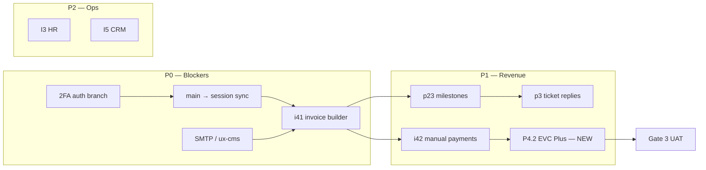

# Somwave — Qorshaha Dhismaha (Build Plan)

| Field | Value |
| --- | --- |
| **Nooca dukumeenti** | Qorshe ansixin — **ma aha** hirgelin |
| **Taariikhda** | 22 Sebtember 2026 |
| **Ilaha** | `CLAUDE.md`, `docs/STATUS_REPORT.md`, `docs/WORKLOG.md`, `docs/SOMWAVE_PROJECT_REPORT.md`, `docs/FRONTEND_VISIBILITY.md`, laamo `origin/cursor/*`, `origin/main` |
| **Luqadda** | Soomaali (magacyada farsamo — Ingiriisi sida caadiga ah) |
| **Xaaladda** | **Sugitaan ansixin isticmaale** ka hor hirgelin kasta |

---

## 1. Kooban & mabaadi’da (Executive Summary)

Somwave waa **hal madal** oo saddex dhagaystayaal u adeega: websaydh dadweynaha (Astro), nidaam gudaha + CMS (React), iyo portal macmiil (React isla app-ka). Qorshahan wuxuu qeexayaa **waxa xiga**, **sida loo isku xiro**, iyo **shuruudaha dhammayn** — iyadoo la raacayo `CLAUDE.md`.

### 1.1 Mabaadi’da aan la jabin karin

1. **Gates (§3):** Gate 0 (F0) waa la dhaafay koodh ahaan. Gate 1 waa in Internal ka hor Portal features-ka akhriska. Gate 2: sub-phase kasta waa **vertical slice** buuxa (schema → migration → service → API → UI → test → staging). Gate 3: **phase ma dhammayn** ilaa staging + PM aqbal.
2. **Ma jiro scope creep:** Refactor aan la codsan, feature cusub ka hor dhammaynta slice-ka hadda, ama mobile ka hor P1–P4 — waa mamnuuc.
3. **Contract first (§16):** `packages/shared` → Prisma → service → routes → frontend feature → router + permission.
4. **Amniga:** Scoping per-user, 404 (ma aha 403) qof kale, RBAC backend-ka, 2FA roles mudnaanta leh.
5. **PR ≤ 400 LOC** halkii sub-phase; weyn → kala qaybi.

### 1.2 Ujeeddada qorshahan

- Isku dubarid **xaaladda hadda** iyo **laamo furan**.
- Bixin **taxane isku-darka (merge sequence)** iyo **silsiladaha ku tiirsanaanta**.
- Qeex **P0–P3** si PM u ansixiyo mudnaanta.
- Sii **checklist deploy** (Coolify, `VITE_*` buildtime).
- Go’aannada furan (§18) + **default talo** haddii la go’aan waayo.

**Fariin cad:** Dukumeentigan ma bilaabayo koodh. Hirgelin waxay bilaabataa marka qaybta **Sign-off** ee hoose la saxeexo.

---

## 2. Sawirka xaaladda hadda (Current State Snapshot)

### 2.1 Git & deploy

| Laan | Macnaha |
| --- | --- |
| `origin/main` | Production track: homepage UI (#42), Coolify fixes (#36–#41), CI green |
| `origin/claude/new-session-o05c30` | Integration branch: platform wave (#31), merge main (#35), warbixin mashruuc (#50) |
| **Farqiga** | `main` iyo session: ~9 / ~7 commits kala duwan — **staging waa in la sync-gareeyaa main** ka hor Gate 3 UAT |

**Deploy (koodh):** Backend Dockerfile, Redis AUTH, CORS, Astro Coolify, portal cookies — ku jira `main`. **Gate 3 staging accepted:** ❌ weli.

### 2.2 Qiimeyn track (qiyaas farsamo, ma aha rasmiga PM)

| Track | ~% | Xaaladda |
| --- | --- | --- |
| F0 Foundation | 92 | 2FA, S3, BullMQ dhiman |
| W Website + CMS | 85 | Media library, i18n URL buuxa qayb |
| I Internal | 45 | I4 buuxa, HR, CRM, Kanban ma jiraan |
| P Portal | 35 | Milestones/tickets/replies laamo; lacag bixin ma jiraan |
| M Mobile | 0 | Lama bilaabin (sida qorshaha) |
| Deploy / Ops | 50 | Coolify diyaar; UAT ma jiraan |

### 2.3 Wax la gaaray (kooban)

- **F0:** Auth, RBAC, UI kit, AppShell, DatePicker, CI.
- **W:** Bogag dadweynaha, CMS modules, newsletter/SEO/i18n aasaas, contact/careers → leads/applications.
- **I:** Users, roles, projects, tasks, milestones, timesheets, leads, recruitment inbox, invoice **draft/list**.
- **P:** Client shell, portal projects, tickets list/create, invoice read qayb.

---

## 3. Shaqo socota — laamo `cursor/*` (In-flight Work)

Laamaha hoose waxay ka **horeeyaan** `origin/claude/new-session-o05c30`. Qaar waa **stack** (isku commits) — merge waa in loo qorsheeyaa si aan loo duubin.

### 3.1 Khariidada laamo → phase

| Laan | Phase / slice | Waxa ku jira (commit-ka ugu dambeeya) | Complexity |
| --- | --- | --- | --- |
| `cursor/i41-invoice-builder-90f3` | **I4.1** | Send, void, tax, detail, print | **M** |
| `cursor/p23-portal-milestones-90f3` | **P2.3** | Milestone list scoped macmiil | **S** |
| `cursor/p3-ticket-replies-90f3` | **P3** (detail/replies/assignment) | Ticket detail, replies, assignment, status UI | **M** |
| `cursor/auth-2fa-login-so-90f3` | **F0 / §13** | 2FA enrollment + login Somali | **M** |
| `cursor/ux-cms-cards-90f3` | **W4 UX** + mail | CMS dashboard cards, SMTP (#49 stack) | **S–M** |
| `cursor/smtp-mailer-90f3` | **F0 / I4** | SMTP + templates (overlap ux-cms) | **M** |
| `cursor/i42-manual-payments-90f3` | **I4.2** (manual) | Bank transfer + reconciliation | **M** |
| `cursor/parallel-platform-build-e229` | Wave hore | **Merged** (#31) — tixraac kaliya | — |
| `cursor/*-coolify-*`, `web-homepage-ui` | Deploy | **Merged main** (#32–#42) | — |
| `cursor/project-status-report-8485`, `cursor/status-report-so-2466` | Docs | Warbixin — ka fog merge feature | — |

### 3.2 Shuruudaha dhammayn laamo furan (Gate 2 + §15)

Laamo kasta waa in la hubiyo ka hor merge:

- [ ] CI: typecheck, lint, build, tests (coverage ≥ 70% touched areas)
- [ ] Scoping test: user kale → 404
- [ ] RBAC: allowed + refused per role (`FRONTEND_VISIBILITY.md`)
- [ ] Afar xaalad UI: loading, empty, error, success
- [ ] Somali copy (ama i18n haddii surface-ka la taageeray)
- [ ] Staging smoke ka dib merge (qaybta 8)

### 3.3 Taxane isku-darka la talinaysan (Recommended Merge Sequence)

**Ujeeddo:** Yaraynta conflict, ixtiraam Gate 1, silsilad invoice → payment.

```text
Tallaabo 0 (P0):  origin/main → claude/new-session-o05c30  (sync homepage + deploy fixes)
Tallaabo 1:        cursor/i41-invoice-builder-90f3         → I4.1 buuxa
Tallaabo 2:        cursor/p23-portal-milestones-90f3      → P2.3 (Gate 1: I2.3 ✅)
Tallaabo 3:        cursor/p3-ticket-replies-90f3          → P3 replies/assignment
Tallaabo 4:        cursor/auth-2fa-login-so-90f3          → 2FA (kala saar stack haddii PR weyn)
Tallaabo 5:        cursor/ux-cms-cards-90f3               → SMTP + CMS UX (dooro HAL smtp branch)
                   (HA ku darin smtp-mailer haddii ux-cms hore u wato isla commits)
Tallaabo 6:        cursor/i42-manual-payments-90f3        → I4.2 manual (ka dib I4.1 + SMTP)
Tallaabo 7:        Staging UAT + Gate 3 sign-off
Tallaabo 8:        Feature cusub: P4.2 EVC Plus, S3, SLA P3.3, iwm. (qaybta 5)
```

**Fiiro:** `auth-2fa`, `smtp`, `p3`, `i42` waxay wadaagaan commits — **dib u habeyn (rebase) ama PR keli keli ah** ayaa ka fiican merge isku mar ah oo duuban.



---

## 4. Mudnaanta (Priority Tiers)

| Tier | Macnaha | Tusaalooyin |
| --- | --- | --- |
| **P0** | Staging/production blockers, amni, silsilad lacag bixin aasaas | Sync main, 2FA, SMTP, I4.1 merge, deploy env checklist, Gate 3 |
| **P1** | Qiimo macmiil / dakhli toos ah | P2.3, P3 replies, P4.1 read buuxa, I4.2 manual, P4.2 EVC Plus, S3 uploads (CV/invoice) |
| **P2** | Hawlgelinta gudaha | HR attendance/leave, CRM deals, Kanban, timesheet approval, accounting aasaas |
| **P3** | Mobile, BI, nice-to-have | M1–M3 Expo, executive BI, media library, URL i18n buuxa |

**Xeer:** P2 feature ma bilaabmo haddii P0/P1 slice la xiriira uu 90% yahay (Gate 3).

---

## 5. Jidka marxaladdaha (Phased Roadmap)

### 5.1 Waqtiga ASCII (dependencies)

```text
2026 Q3-Q4 (hadda)
|-- P0: sync + merge laamo + 2FA + SMTP + I4.1 + staging UAT
|
2026 Q4 - 2027 Q1
|-- P1: P2.3, P3, I4.2 manual, P4.2 EVC, S3, P3.3 SLA
|
2027 Q1-Q2
|-- P2: I3 HR, I5 CRM, I2 Kanban/Gantt, I4 accounting reports
|
2027 Q2+
|-- P3: M1-M3 mobile (after P1-P4 stable)
```

### 5.2 Jadwalka dependencies (table)

| Sub-phase | Ujeeddo | Deliverables muhiim ah | Complexity | Blocked-by | Risks |
| --- | --- | --- | --- | --- | --- |
| **F0.5 2FA** | §13 compliance | Enrollment, TOTP, role gate ADMIN+ | M | — | UX lockout; recovery codes |
| **F0.6 SMTP** | Email transactional | `SMTP_*`, templates invoice/inquiry | M | DNS SPF/DKIM | Spam; env runtime |
| **F0.7 S3** | Uploads ammaan | Presigned, MIME magic, 25MB | M | S3 creds Coolify | CV/recruitment blocked |
| **W5.6 Media CMS** | CMS media | MediaAsset UI, link posts | M | S3 | Scope W4 |
| **W5.7 i18n URL** | /so /en /ar routes | Astro + app parity | L | — | SEO redirects |
| **I4.1 buuxa** | Invoice builder | PDF/print, send, void, tax, statuses | M | SMTP | Half-built blocks P4 |
| **I4.2 manual** | Bank transfer | Record payment, reconcile invoice | M | I4.1 | Must precede gateway |
| **I4.2 webhook** | Gateway reconcile | Idempotent webhook, Payment model | L | P4.2 | Money bugs |
| **P2.3** | Portal milestones | List/detail scoped | S | I2.3 ✅ | Branch stack |
| **P3.1+** | Tickets buuxa | Replies, assignment, status | M | I1.2 ✅ | |
| **P3.3** | SLA & assignment | Due dates, assignee, notifications | M | P3.1+, SMTP | |
| **P4.1** | Portal invoices | Pay flow entry, line items read | S | I4.1 | |
| **P4.2** | EVC Plus | Gateway interface, Idempotency-Key | L | P4.1, I4.1 | Vendor API |
| **I3.x HR** | Attendance, leave, payroll | Models hr.prisma, approvals | L | §18 payroll format | Legal format |
| **I5 CRM** | Deals, quotations | Lead → deal pipeline | M | I5.1 ✅ | |
| **I2 PM UX** | Kanban, Gantt | Task views | L | I2.2 ✅ | |
| **P5–P6** | Documents, messages, contracts | portal.prisma models | L | S3, I2 | New models |
| **M1–M3** | Expo app | Reuse API, auth cookies strategy | L | P1–P4 Gate 3 | Auth on mobile |

---

## 6. Faahfaahin sub-phase (objectives, acceptance, risks)

Criteria hoose waa **nuqul ka mid ah `CLAUDE.md` §15** — checklist kasta waa in la buuxiyaa sub-phase kasta.

### 6.1 P0 — Production-ready core

#### P0-A: Sync `main` → session + deploy smoke

| | |
| --- | --- |
| **Ujeeddo** | Homepage #42 iyo fix-yada production in ay ku jiraan integration branch |
| **Deliverables** | Merge/rebase; CI green; `/health` ok staging |
| **Acceptance (§15)** | Dhammaan 13 shuruudood + smoke: login portal, public home, API CORS |
| **Complexity** | **S** |
| **Risks** | Merge conflicts platform wave |
| **Blocked-by** | — |

#### P0-B: Merge `i41-invoice-builder-90f3` (I4.1)

| | |
| --- | --- |
| **Ujeeddo** | Qaansheeg la diri karo, PDF/print, void, tax, detail |
| **Deliverables** | shared schema, migration haddii loo baahdo, service, internal UI + portal read |
| **Acceptance** | §15 + invoice send triggers email (ka dib SMTP) ama queue documented |
| **Complexity** | **M** |
| **Blocked-by** | P0-A |
| **Risks** | Decimal money; status enum |

#### P0-C: Merge `auth-2fa-login-so-90f3`

| | |
| --- | --- |
| **Ujeeddo** | 2FA qasab SUPER_ADMIN, ADMIN, MANAGER |
| **Deliverables** | Enrollment flow, login step, lockout policy |
| **Acceptance** | §15 + privileged without 2FA → blocked |
| **Complexity** | **M** |
| **Blocked-by** | P0-A (recommended parallel review) |

#### P0-D: Merge SMTP (`ux-cms-cards-90f3` **or** `smtp-mailer-90f3` — hal doorasho)

| | |
| --- | --- |
| **Ujeeddo** | SMTP runtime backend; templates inquiry + invoice |
| **Deliverables** | `mailer` service, env validation, no secrets in client |
| **Acceptance** | §15 + test email staging |
| **Complexity** | **M** |
| **Blocked-by** | Coolify `SMTP_*` runtime |
| **Risks** | Duplicate merge haddii labada laamo la isku daro |

#### P0-E: Gate 3 — Staging UAT

| | |
| --- | --- |
| **Ujeeddo** | PM aqbalid rasmi ah |
| **Deliverables** | UAT script, bug list P0/P1, sign-off sheet |
| **Acceptance** | §15 platform-wide on staging |
| **Complexity** | **M** (process) |
| **Blocked-by** | P0-A–D + merge P23/P3 haddii PM uu doonayo portal buuxa UAT |

---

### 6.2 P1 — Revenue & macmiil

#### P1-A: `p23-portal-milestones-90f3` (P2.3)

| | |
| --- | --- |
| **Ujeeddo** | Macmiil arko milestones mashaariicda |
| **Deliverables** | `GET` portal scoped, UI list/detail |
| **Acceptance** | §15 + clientId filter test |
| **Complexity** | **S** |
| **Blocked-by** | I2.3 ✅, P0-B recommended |

#### P1-B: `p3-ticket-replies-90f3`

| | |
| --- | --- |
| **Ujeeddo** | Ticket detail, replies, assignment, status |
| **Deliverables** | TicketReply API, internal + portal UI |
| **Acceptance** | §15 + CLIENT cannot assign unless spec |
| **Complexity** | **M** |
| **Blocked-by** | P3.1 ✅ |

#### P1-C: `i42-manual-payments-90f3` (I4.2 partial)

| | |
| --- | --- |
| **Ujeeddo** | Lacag bixin bangi gacanta + reconcile |
| **Deliverables** | Payment model/migration, manual record UI |
| **Acceptance** | §15 + invoice status PARTIAL/PAID |
| **Complexity** | **M** |
| **Blocked-by** | I4.1, SMTP |

#### P1-D: P4.2 EVC Plus (**cusub — ma jiro laan**) 

| | |
| --- | --- |
| **Ujeeddo** | Lacag bixin online Somalia |
| **Deliverables** | `PaymentGateway` interface, webhook, Idempotency-Key |
| **Acceptance** | §15 + sandbox payment end-to-end |
| **Complexity** | **L** |
| **Blocked-by** | P4.1, I4.1, P1-C |
| **Risks** | Vendor docs; webhook replay |

#### P1-E: S3 uploads (F0.7)

| | |
| --- | --- |
| **Ujeeddo** | CV, documents, invoice attachments |
| **Deliverables** | storage service, presigned URLs |
| **Acceptance** | §15 + MIME verify |
| **Complexity** | **M** |
| **Blocked-by** | Coolify S3 runtime vars |

#### P1-F: P3.3 SLA & assignment

| | |
| --- | --- |
| **Ujeeddo** | Assign staff, due dates, notifications |
| **Deliverables** | SLA fields, BullMQ reminder job |
| **Acceptance** | §15 + SMTP notifications |
| **Complexity** | **M** |
| **Blocked-by** | P1-B, P0-D, Redis jobs |

---

### 6.3 P2 — Internal operations

| Sub-phase | Ujeeddo | Complexity | Blocked-by |
| --- | --- | --- | --- |
| **I3.1–3.3 Attendance/Leave** | HR maalinle + fasax | **L** | Gate 3, §18 retention |
| **I3.4 Payroll** | Payroll run | **L** | §18 statutory format |
| **I5.2 Deals** | Lead → deal | **M** | I5.1 ✅ |
| **I5.3 Quotations** | Quotes PDF | **M** | I5.2 |
| **I2.5 Kanban** | Task board | **M** | I2.2 ✅ |
| **I2.6 Gantt** | Timeline view | **L** | I2.5 |
| **I4.3–4.5 Accounting** | Budget, journal, reports | **L** | §18 system of record |
| **I6 Assets** | Asset register | **M** | — |

Acceptance dhammaan: **§15** + permission keys documented.

---

### 6.4 P3 — Mobile & enhancements

| Sub-phase | Ujeeddo | Complexity | Blocked-by |
| --- | --- | --- | --- |
| **M1** | Expo shell, auth | **M** | P1–P4 stable, Gate 3 |
| **M2** | Portal features mobile | **L** | M1 |
| **M3** | Push, offline read | **L** | M2 |
| **W5.6 Media library** | CMS files | **M** | S3 |
| **I7 BI** | Executive dashboards | **L** | I4 data |

---

## 7. Dejinta & deegaanka (Environment / Deploy Checklist)

### 7.1 Coolify — nooca env vars (§14)

| Service | Variables | Nooca Coolify |
| --- | --- | --- |
| Backend | `DATABASE_URL`, `REDIS_URL`, `JWT_SECRET`, `ANTHROPIC_API_KEY`, `SMTP_*`, `PAYMENT_*`, S3 keys | **Runtime** |
| Frontend | `VITE_API_URL`, other `VITE_*` | **Buildtime** |
| Web (Astro) | `PUBLIC_*` | **Buildtime** |

### 7.2 Pre-deploy checklist

- [ ] `npm ci` → `prisma migrate deploy` (backup DB hore)
- [ ] `/health` pings Postgres + Redis (internal hostnames)
- [ ] `app.set('trust proxy', 1)` behind Traefik
- [ ] CORS: `app.somwave.com`, `somwave.com`, staging origins
- [ ] Frontend rebuild haddii `VITE_API_URL` is beddelo
- [ ] TLS Traefik: saddex domain (`somwave.com`, `app.somwave.com`, `api.somwave.com`)
- [ ] Redis AUTH aligned (#36)
- [ ] Portal cookies: Secure, SameSite (#41)
- [ ] Rate limit login: IP **+** account
- [ ] SMTP SPF/DKIM/DMARC before production email

### 7.3 Debug order (marka deploy jabo)

1. Build log  
2. Runtime log  
3. Env nooca (buildtime vs runtime)  
4. `/health`  
5. Traefik routing + cert  
6. Browser network + CORS  

---

## 8. Go’aannada furan (§18) + default talo

| Su’aal | Saamaynta | Default talo (haddii aan la go’aan) |
| --- | --- | --- |
| Hal shirkad — hal login mise badan? | `Client` ↔ `User` 1:1 vs 1:N | **1:1 P1** sida §17; qorshee 1:N P5 marka loo baahdo |
| Payroll/accounting qaab sharci? | I4.5 report layouts | **Somwave I4 = system of record**; export CSV/PDF generic ilaa spec la siiyo |
| Static vs SSR websaydh? | Publish latency vs cost | **Hybrid** (hadda): static badan + SSR meelaha loo baahdo |
| Nidaam xisaabeed hore? | Integrations | **No external** phase 1; API export mustaqbal |
| Data retention shaqaale? | `deletedAt` HR | **7 sano** ka dib exit (placeholder); PM/legal waa in ay xaqiijiyaan |

---

## 9. Maamulka tayada & habka shaqada

- **Vertical slice keli:** Backend-only PR → diidmo Gate 2.
- **Definition of done:** §15 — dhammaan 13 items sub-phase kasta.
- **Visibility:** `docs/FRONTEND_VISIBILITY.md` + RBAC tests.
- **Warbixin:** Ka dib phase, cusboonaysii `STATUS_REPORT.md` + `WORKLOG.md`.
- **Assumption log:** Wax kasta oo la qaatay qoraal ahaan UAT ama PR description.

---

## 10. Ansixin (Sign-off) — **User approval required**

Foomkan waa in **isticmaaluhu (PM / milkiilaha Somwave)** buuxiyaa ka hor hirgelin.

### 10.1 Ansixin qorshaha guud

| Su’aal | Haa / Maya / Faallo |
| --- | --- |
| Ma ogolahey mabaadi’da Gates & vertical slices? | |
| Ma ogolahey taxane merge (qaybta 3.3)? | |
| Ma ogolahey mudnaanta P0–P3? | |
| Ma ogolahey default-yada §18? | |

**Saxeex:** _________________________ **Taariikh:** _____________

---

### 10.2 **User approval required before Phase P0 implementation**

P0 waxaa ka mid ah: sync main, merge laamo I4.1/2FA/SMTP, staging UAT.

| Item | Ogolaansho |
| --- | --- |
| Bilaab P0 (sync + merges) | [ ] Haa  [ ] Maya |
| Doorashada laamo SMTP: `ux-cms-cards` / `smtp-mailer` | ______________ |
| UAT scope (portal + invoice + 2FA) | [ ] Haa  [ ] Maya |

**Saxeex:** _________________________ **Taariikh:** _____________

---

### 10.3 **User approval required before Phase P1 implementation**

P1 waxaa ka mid ah: milestones, ticket replies, manual payments, **EVC Plus cusub**, S3, SLA.

| Item | Ogolaansho |
| --- | --- |
| Bilaab P1 ka dib Gate 3 ama waafaqsan PM | [ ] Haa  [ ] Maya |
| EVC Plus vendor credentials diyaar | [ ] Haa  [ ] Maya |
| S3 bucket production | [ ] Haa  [ ] Maya |

**Saxeex:** _________________________ **Taariikh:** _____________

---

### 10.4 **User approval required before Phase P2 implementation**

P2: HR, CRM, Kanban, accounting buuxa.

**Saxeex:** _________________________ **Taariikh:** _____________

---

### 10.5 **User approval required before Phase P3 (Mobile) implementation**

P3: M1–M3 Expo — **kaliya** ka dib P1–P4 stable + Gate 3.

**Saxeex:** _________________________ **Taariikh:** _____________

---

## 11. Lifaaq

| Document | Ujeeddo |
| --- | --- |
| [`CLAUDE.md`](../CLAUDE.md) | Qorshe rasmiga ah |
| [`SOMWAVE_PROJECT_REPORT.md`](./SOMWAVE_PROJECT_REPORT.md) | Warbixin xaaladda |
| [`STATUS_REPORT.md`](./STATUS_REPORT.md) | Snapshot gaaban |
| [`WORKLOG.md`](./WORKLOG.md) | Slice-by-slice log |
| [`FRONTEND_VISIBILITY.md`](./FRONTEND_VISIBILITY.md) | Role → nav |

---

*Qorshahan waxaa diyaariyay falanqayn repository — **ma aha** hirgelin. Cusboonaysiinta xigta: ka dib ansixin isticmaale iyo dhammaadka P0.*
